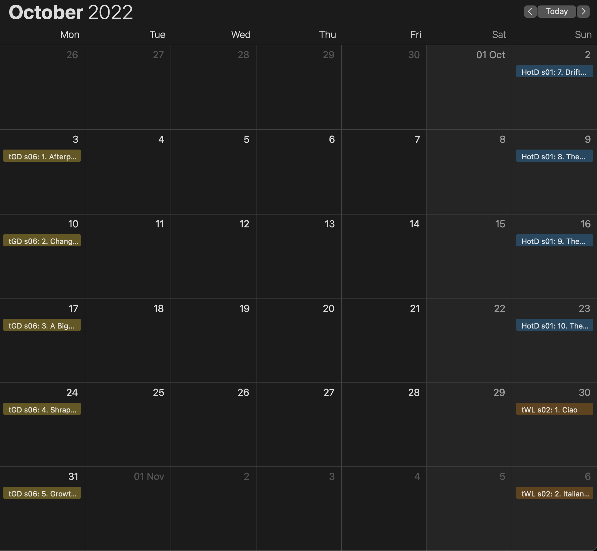

# [C3](https://github.com/beyarkay/c3) TV Series: Airing dates in your calendar

This project automatically scrapes data from [Rotten
Tomatoes](https://www.rottentomatoes.com/) about the airing dates of certain TV
shows, and converts them into an Internet-based calendar. So you can go to the
[latest
release](https://github.com/beyarkay/c3-tv-series/releases/tag/latest-calendars)
and choose a calendar to subscribe to. Once you've subscribed, you'll be able
to see your favourite TV show in your calendar.

For example, in this image you can see three different calendars: `HotD` (House
of the Dragon), `tGD` (The Good Doctor), and `tWL` (The White Lotus). Each
event in the calendar is the day on which a particular episode for that series
aired on TV.

This project was created using [C3](https://github.com/beyarkay/c3) .
